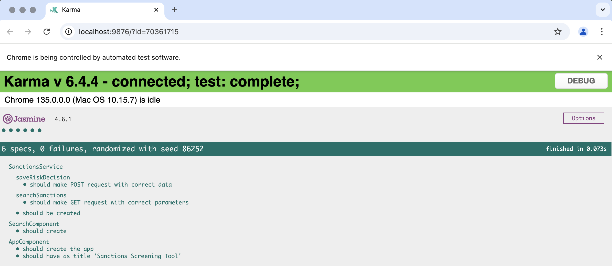

# Sanctions Screening Application

A web application that allows users to search for sanctioned entities, assess risk levels, and store decisions.

## Table of Contents
* [Features](#features)
* [Tech Stack](#tech-stack)
* [Setup Instructions](#setup-instructions)
* [Backend Implementation](#backend-implementation)
* [Frontend Implementation](#frontend-implementation)
* [Sample Test Cases](#sample-test-cases)
* [Unit Tests](#unit-tests)
* [Future Improvements](#future-improvements)

## Features
* Search for entities in sanctions lists through the sanctions.network API
* View search results with calculated risk scores
* Make and save risk assessments for each entity
* Responsive UI with Angular Material components

## Tech Stack
* **Frontend**: Angular 17 with Angular Material  
* **Backend**: Django REST Framework  
* **Database**: PostgreSQL  
* **Containerization**: Docker  

## Setup Instructions

### Prerequisites
* Docker and Docker Compose
* Git

### Installation
1. Clone the repository:
```bash
git clone 
cd sanctions-screening
```

2. Clone the repository:
Create a .env file in the root directory:
```bash
POSTGRES_PASSWORD=postgres
POSTGRES_USER=postgres
POSTGRES_DB=postgres
POSTGRES_HOST=db
```

3. Build and start the Docker containers:
```bash
docker-compose up --build
```

4. Access the application:
* Frontend: http://localhost:4200
* Backend API: http://localhost:8000/api/
* Django Admin: http://localhost:8000/admin/

## Backend Implementation

### Overview
The backend is a Django REST API providing sanctions search with fuzzy matching and decision recording capabilities.

### Key Components
- Sanctions Search API: Fuzzy matching against external sanctions data
- Decision Recording API: Persists user decisions about potential matches
- Data Model: Captures entity details, match information, and risk assessments
- Utility Functions: Implements string matching and risk classification
- Pagination: Handles large result sets with configurable page sizes

### Technology Stack
- Django REST Framework, PostgreSQL, Docker
- Fuzzy string matching with Python's difflib SequenceMatcher
- Error handling with comprehensive logging

## Frontend Implementation

### Overview
An Angular application providing an intuitive interface for searching entities and recording risk decisions.

### Key Components
- Search Interface: User-friendly input with empty state handling
- Results Display: Material table with visual risk indicators
- Review Modal: Entity assessment interface with success/error feedback

### Technology Stack
- Angular 17, Angular Material, ngx-toastr
- Containerized with Node.js 20 and Angular CLI

## Sample Test Cases

### Frontend Test Cases

#### 1. Empty Search

**Input**: Search term "xxx"

**Expected**: "No Results Found" message displayed

#### 2. Valid Search

**Input**: Search term "John"

**Expected**: Results table with matching entities

#### 3. Risk Assessment Flow

**Steps**:
1. Search for "John"
2. Click "Review" on a result
3. Change risk level
4. Click "Save"

**Expected**: Success notification, modal closes

### Backend Test Cases

#### 1. API Search Endpoint
* **Request**: `GET http://localhost:8000/api/search/?name=john`
* **Expected Response**:
  ```json
  {
    "status": 200,
    "data": [
      {
        "entity_id": "1234",
        "name": "John Doe",
        "risk_score": 75,
        "source": "ofac"
      }
    ]
  }
  ```
  * Status: 200 OK
  * JSON with matching entities, each containing risk scores

#### 2. Missing Parameter
* **Request**: `GET http://localhost:8000/api/search/`
* **Expected Response**:
  * Status: 400 Bad Request
  * Error message about missing parameter

#### 3. Save Decision
* **Request**: `POST http://localhost:8000/api/save-decision/`
* **Expected Response**:
  ```json
  {
  "entity_id": "1234",
  "source": "ofac",
  "source_id": "SDN-1234",
  "target_type": "individual",
  "matched_name": "John Smith",
  "risk_score": 85,
  "risk_level": "high",
  "listed_on": "2023-01-01"
  }
  ```
  * Status: 201 Created
  * JSON with created record


## Unit tests

### Current Coverage


**Frontend**:
- ✅ Services tested
- ❌ Components need coverage
- ❌ Pipes/Directives need coverage

**Backend**:
- 🚧 Testing not yet implemented (see Future Improvements)


## Future Improvements
### Backend
- Caching for frequent searches
- Rate limiting and authentication
- Asynchronous processing
- Enhanced matching algorithms

### Frontend
- Advanced filtering options
- Autocomplete for entity search
- Complete migration to reactive forms
- Expanded test coverage
